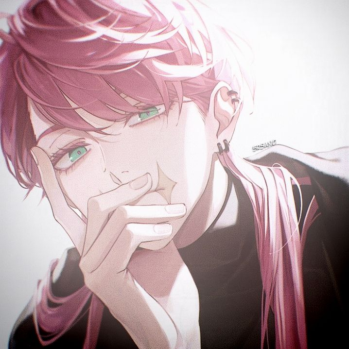

# 🎂 her-bday — Template Ucapan Ulang Tahun Interaktif

Template open-source berbasis HTML untuk membuat halaman ucapan ulang tahun interaktif dan estetik. Termasuk greeting, musik, galeri foto polaroid, hingga minigame sederhana. Cocok dijadikan hadiah digital yang unik dan personal.

## ✨ Fitur

- 🎉 Halaman ucapan ulang tahun personal
- 🎵 Musik latar otomatis
- 🕹️ Minigame sederhana
- 📸 Galeri polaroid
- 💌 Desain visual sederhana & manis
- 💻 100% berbasis HTML/CSS/JS (tanpa framework)

## 🔧 Cara Menggunakan
## ✨ Bagian yang Perlu Disesuaikan

Berikut adalah bagian-bagian yang bisa/harus kamu ubah untuk menyesuaikan templat ini dengan orang yang ingin kamu beri kejutan ulang tahun.

### 1. 🎉 Nama Ulang Tahun
- Cari dan ganti semua `[Nama Kamu]` di seluruh file. CTRL + F

### 2. 🖼️ Foto Karakter
Ganti file ./img/mainpp.jpeg dengan gambar lain sesuai karakter yang kamu inginkan.
Pastikan ukuran gambar persegi agar proporsional saat ditampilkan.
Nama file bisa disesuaikan, tapi pastikan path-nya cocok di HTML:
```

```

### 3. 🔊 Musik Latar
Ganti file ./music/w2e.mp3 dengan lagu latar favorit penerima.
Pastikan format .mp3.
Update path-nya jika perlu:
```
<source src="./music/w2e.mp3" type="audio/mpeg">
```